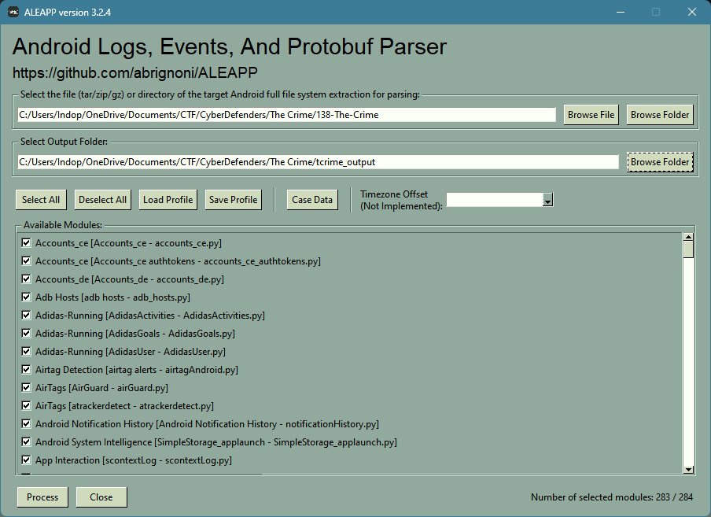
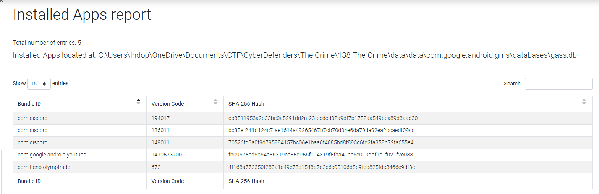
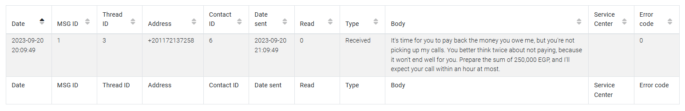
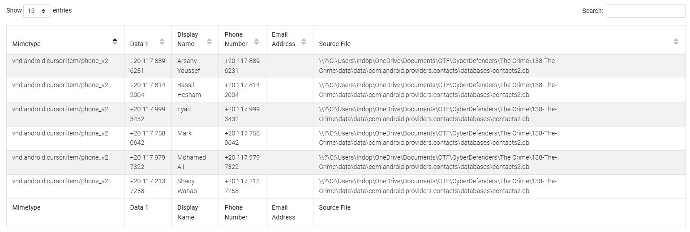
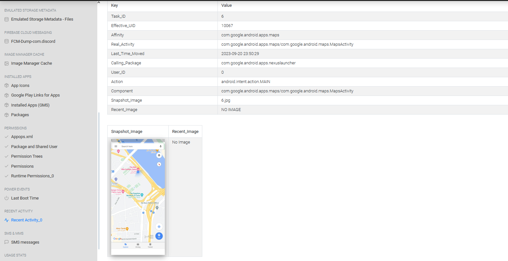
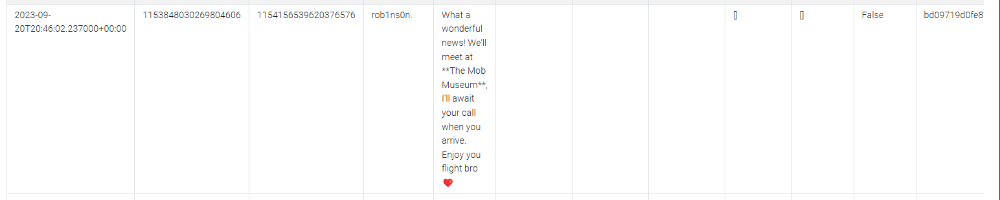
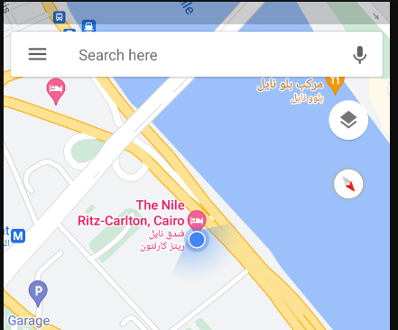
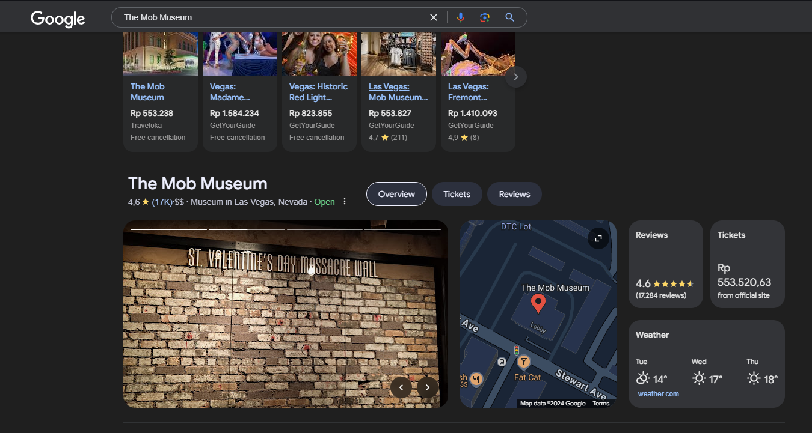

# The Crime

**Category**: Endpoint Forensics

## Scenario
> We're currently in the midst of a murder investigation, and we've obtained the victim's phone as a key piece of evidence. After conducting interviews with witnesses and those in the victim's inner circle, your objective is to meticulously analyze the information we've gathered and diligently trace the evidence to piece together the sequence of events leading up to the incident.
>
> Resources:
> - [Android-Forensics-References](https://github.com/RealityNet/Android-Forensics-References)

## Solution

Unzip the `138-The-Crime.zip` and use `ALEAPPGUI` to parse it.

### Question 1
> Based on the accounts of the witnesses and individuals close to the victim, it has become clear that the victim was interested in trading. This has led him to invest all of his money and acquire debt. Can you identify which trading application the victim primarily used on his phone?

We can go to the `Installed Apps (GMS)` on the left navigation.

Answer: `Olymp Trade`

### Question 2
> According to the testimony of the victim's best friend, he said, "While we were together, my friend got several calls he avoided. He said he owed the caller a lot of money but couldn't repay now". How much does the victim owe this person?

We can go to the `SMS messages` on the left navigation.

Answer: `250000`

### Question 3
> What is the name of the person to whom the victim owes money?

the number is `+201172137258`, we can go to the contacts page to see who have this phone number.

Answer: `Shady Wahab`

### Question 4
> Based on the statement from the victim's family, they said that on September 20, 2023, he departed from his residence without informing anyone of his destination. Where was the victim located at that moment?

Answer: `The Nile Ritz-Carlton`

### Question 5
> The detective continued his investigation by questioning the hotel lobby. She informed him that the victim had reserved the room for 10 days and had a flight scheduled thereafter. The investigator believes that the victim may have stored his ticket information on his phone. Look for where the victim intended to travel.

Let's search `The Mob Museum` in google

Answer: `Las Vegas`

### Question 6
> After examining the victim's Discord conversations, we discovered he had arranged to meet a friend at a specific location. Can you determine where this meeting was supposed to occur?

We already know the place from the discord chat before.

Answer: `The Mob Museum`

## Tools used

[ALEAPP](https://github.com/abrignoni/ALEAPP)